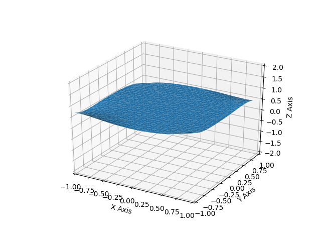
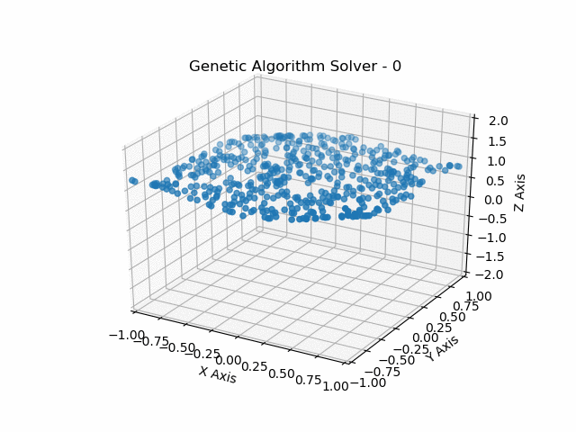

# Global Max Project

### Introduction
---
The purpose of this project is to create a testing environment for benchmarking different search algorithms in n-dimensional space to access the tradeoffs of different strategies. This also created an opportunity for implementation of existing and experimental search algorithms for testing/educational purposes.

The impact of this project is the ability to create problems dynamically and visualize the performance of algorithms and evaluate the performance over different parameters such as search speed and accuracy.

### Examples
---

**Problem**:
This is an example polynomial where (x,y) is the search space and the z-axis is the evaluated values

**Brute Force**:
This specific example uses a brute force solver over a capped 1,000,000 iterations to search for the max by simply iterating through the space and searching for the maximum value.

**Genetic Algorithm**:
The genetic algorithm uses an evolutional approach to solve the same problem in 31 generations with a population size of 500.

**Staticstics**
|| Brute Force Solver | Genetic Algorithm Solver |
| --- | --- |
| Time Taken | 3.81 seconds | 0.129 seconds |
| Solution | 1.90904270986 | 1.8964056831 |

## Usage
#### Problem
The problem is a generalized concept of some n-dimensional space that could be explored and evaluated to return some value, which would be the parameter to maximize globally. In this specific case, the problem of choice is a n-dimensional, m-term polynomial.

#### Solver
The solver is a generalized search strategy that would attempt to find a global maxima of the problem and would be evaulated using the benchmark class or visualized.

#### Benchmark
The benchmark class accepts multiple solvers and evaulates them individually and takes a measurement of their relevant statistics such as evaluation time, max solution, and the max solution vector.

#### Visualization
Visualization currently only works for 3-dimensional problems, which is a 2-dimensional search space with the 3rd spacial dimension used to plot the solution of the 2-d search space.

For the gifs, each type of solver has it's own way or storing `frames` that are represented in the gifs by taking a subset of the frames and plotting the points that are being searched by each solver in that iteration. This helps visualize what each solver is doing over time while making the gif performant by not trying to plot millions of points per frame.
